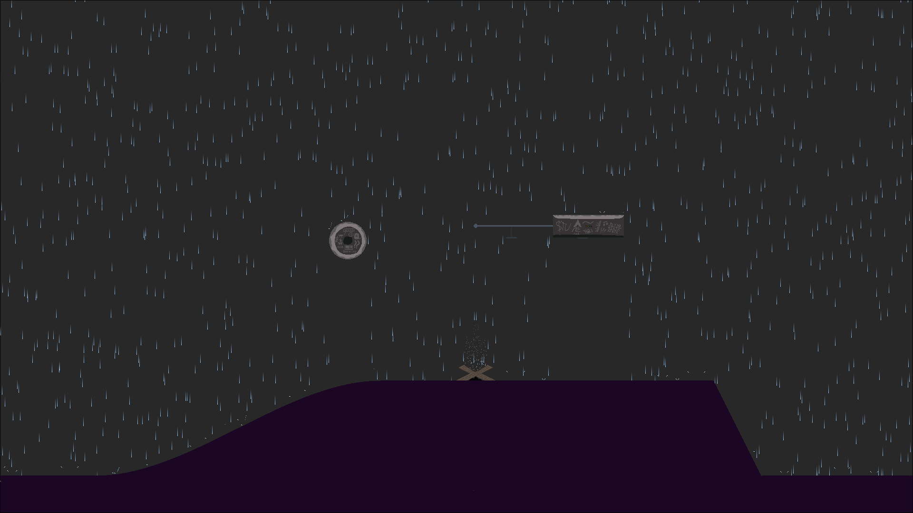

**This project is contained entirely within one shader.**

It's a 1920x1080 demo scene with rain, lightning, fire, smoke, and more!

## Installation and Usage

If you're on x64 Linux, there's an archive with a binary and assets available in the latest release.

Otherwise, install Raylib from their [GitHub](https://github.com/raysan5/raylib/releases/latest) or their [website](https://raylib.com).
Then, clone the repository by clicking Code and downloading then extracting the .zip, by running `git clone https://github.com/dora-explora/shaderdemo.git`, or by running `gh repo clone dora-explora/shaderdemo` if you have the GitHub CLI.
Then, install a C compiler. [GNU Make](https://www.gnu.org/software/make/) is already supported, and it can be installed through [MinGW](https://www.mingw-w64.org/) on Windows, or [XCode command line tools](https://developer.apple.com/documentation/xcode/installing-the-command-line-tools) or [Homebrew](https://brew.sh/) on MacOS. You can also use any other C compiler, like [Visual Studio's build tools](https://learn.microsoft.com/en-us/cpp/build/walkthrough-compile-a-c-program-on-the-command-line?view=msvc-170).
With Make, run `make run` in the folder to begin. Otherwise, compile the code with raylib included as a library and run the executable (usually build/shaderdemo) to begin.

Once you're in, move the mouse around and see the rain interact with it!

## Design

This entire project was made within a **GLSL shader**, which is absolutely stateless. This means that, other than the frame counter, there is no concept of time and absolutely no memory from one frame to the next. However, using deterministic random functions, there is the *illusion* of randomness.

This also means that every pixel runs the exact same program every frame. The only difference is the parameters: the pixel's position, the mouse's position, the current frame, and a few textures. Through lots and lots of branching, each pixel independently chooses which color to be each frame, making the illusion of objects, motion, and continuity where there is none.

GLSL provides no random functions, so every "random" raindrop and color in the scene is actually noise made from floating point inaccuracies. I got this concept from [the book of shaders](https://thebookofshaders.com/10/), which is a great resource if you want to learn shader programming yourself.
